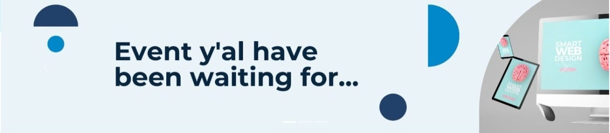
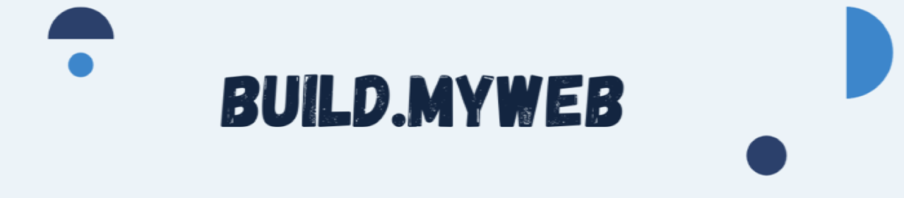

# wafidmuhammed.github.io
<!DOCTYPE html>
<html lang="en">
<head>
    <link href="https://cdn.jsdelivr.net/npm/bootstrap@5.1.3/dist/css/bootstrap.min.css" rel="stylesheet" integrity="sha384-1BmE4kWBq78iYhFldvKuhfTAU6auU8tT94WrHftjDbrCEXSU1oBoqyl2QvZ6jIW3" crossorigin="anonymous">
    <meta charset="UTF-8">
    <meta http-equiv="X-UA-Compatible" content="IE=edge">
    <meta name="viewport" content="width=device-width, initial-scale=1.0">
    <title>Build My Web</title>
    <link rel="stylesheet" href="https://cdnjs.cloudflare.com/ajax/libs/twitter-bootstrap/4.1.3/css/bootstrap.min.css">
    <link rel="stylesheet" href="https://cdnjs.cloudflare.com/ajax/libs/ionicons/2.0.1/css/ionicons.min.css">
    <link rel="stylesheet" href="assets/css/style.css">
    <link href="//maxcdn.bootstrapcdn.com/bootstrap/4.1.1/css/bootstrap.min.css" rel="stylesheet" id="bootstrap-css">

<!------ Include the above in your HEAD tag ---------->

<link rel="stylesheet" href="https://cdnjs.cloudflare.com/ajax/libs/font-awesome/4.7.0/css/font-awesome.css" />

</head>
<body>
    

    <nav class="navbar navbar-expand-lg navbar-light ">
        

          
          <button class="navbar-toggler" type="button" data-bs-toggle="collapse" data-bs-target="#navbarTogglerDemo02" aria-controls="navbarTogglerDemo02" aria-expanded="false" aria-label="Toggle navigation">
            </button>
          

            <ul class="navbar-nav ms-auto mb-2 mb-lg-0">
              <li class="nav-item">
                <a class="nav-link active" aria-current="page" href="#Header">Home</a>
              </li>
              <li class="nav-item">
                <a class="nav-link" href="#Mentor">Mentor</a>
              </li>
              <li class="nav-item">
                <a class="nav-link" href="#Form">Participate</a>
            </ul>
        

    

</nav>

        

    <header id="Header" class="container-fluid">
        

            

              

                
              

              

                
              

              

                
              

            

            <button class="carousel-control-prev" type="button" data-bs-target="#carouselExampleControls" data-bs-slide="prev">
              
              Previous
            </button>
            <button class="carousel-control-next" type="button" data-bs-target="#carouselExampleControls" data-bs-slide="next">
              
              Next
            </button>
          

    </header>

    <h4 class="h1 d-flex align-items-center justify-content-center"> Join Us</h4>
    

    
Pygrammers is a community of python enthusiasts with similar ideologies and interest

    
    
    

        <a href="https://t.me/pygrammers_official" class="btn btn-primary">Telegram</a>

 
 
 

        

    <form class=" border ">
        
        
        
        
        
     

    <label for="text">Name</label>
    <input type="text" class="form-control" id="exampleInputName1" aria-describedby="emailHelp" placeholder="Enter Your Name">
    
  

  

    <label for="number">Personal Number</label>
    <input type="tel" class="form-control" id="exampleInputNumber1" placeholder="Enter Your Personal Mobile Number">
  

  

    <label for="text">Email</label>
    <input type="text" class="form-control" id="exampleInputName1" aria-describedby="emailHelp" placeholder="Enter Your Email">
  

  

    <label for="text">Institutuion Name</label>
    <input type="text" class="form-control" id="exampleInputName1" aria-describedby="emailHelp" placeholder="Enter Your Institution Name">
     
  

  

  

    <input type="file" class="form-control-file" id="exampleFormControlFile1">
  

    
 
 
   
  

     
    <select class="form-group p-2">
      <option selected>Have you attended any Events by Pygrammers before</option>
      <option value="1">One</option>
      <option value="2">Two</option>
      <option value="3">none</option>
    </select>
  

   
 
  

    
<button type="button" class="btn btn-primary">Submit Form</button>

        
  
    
  

    
  

 

</form>

 
 
 
 
 

  
<h2 id="Mentor" class="text-center mn">M e n t o r s </h2>
  

      

     

        

            
            

              
Some quick example text to build on the card title and make up the bulk of the card's content.

        

        

        

    
    

      
Some quick example text to build on the card title and make up the bulk of the card's content.

    

    

        
        

          
Some quick example text to build on the card title and make up the bulk of the card's content.

    

    

    

    

            

                
                

                  
Some quick example text to build on the card title and make up the bulk of the card's content.

            

            

            

            

                

                    
                    

                      
Some quick example text to build on the card title and make up the bulk of the card's content.

                

                

                

                

                    

                        
                        

                          
Some quick example text to build on the card title and make up the bulk of the card's content.

                    

                    

          
 
      

  

 
<footer id="dk-footer" class="dk-footer">
        

            

                

                    

                        
                       
                           
                       
                        

                            <h3>Follow us</h3>
                            <ul>
                                <li>
                                    <a href="https://www.facebook.com/pygrammers/">
                                        <i class="fa fa-facebook"></i>
                                    </a>
                                </li>
                                <li>
                                    <a href="https://twitter.com/pygrammer_">
                                        <i class="fa fa-twitter"></i>
                                    </a>
                                </li>
                                
                                <li>
                                    <a href="https://in.linkedin.com/company/pygrammers">
                                        <i class="fa fa-linkedin"></i>
                                    </a>
                                </li>
                                <li>
                                    <a href="https://www.instagram.com/pygrammers/?hl=en">
                                        <i class="fa fa-instagram"></i>
                                    </a>
                                </li>
                            </ul>
                        

                        <!-- End Social link -->
                    

                    <!-- End Footer info -->
                   
                

                <!-- End Col -->
                

                    

                        

                            

                                

                                    <i class="fa fa-map-o" aria-hidden="true"></i>
                                

                     
                           
                            

                            <!-- End Contact Us -->
                        

                        <!-- End Col -->
                        

                            
                            <!-- End Contact Us -->
                        

                        <!-- End Col -->
                    

                    <!-- End Contact Row -->
                    

                        

                            

                                

                                    <h3>Useful Links</h3>
                                    
                                

                                <ul>
                                    <li>
                                        <a href="https://www.facebook.com/pygrammers/">About us</a>
                                    </li>
                               
                                  
                                </ul>
                                <ul>
                                    <li>
                                        <a href="https://www.facebook.com/pygrammers/">Contact us</a>
                                    </li>
                                 
                                </ul>
                            

                            <!-- End Footer Widget -->
                        

                        <!-- End col -->
                        

                            

                                

                                    <h3>Subscribe</h3>
                                    
                                

                                
<!-- Don’t miss to subscribe to our new feeds, kindly fill the form below. -->
                                Pygrammers is a Community of enthusiastic Python Developers.

                                
                                <!-- End form -->
                            

                            <!-- End footer widget -->
                        

                        <!-- End Col -->
                    

                    <!-- End Row -->
                

                <!-- End Col -->
            

            <!-- End Widget Row -->
        

        <!-- End Contact Container -->

        

            

                

                    

                        Copyright © 2019
                    

                    <!-- End Col -->
                 
                    <!-- End col -->
                

                <!-- End Row -->
            

            <!-- End Copyright Container -->
        

        <!-- End Copyright -->
        <!-- Back to top -->
        

            <button class="btn btn-dark" title="Back to Top" style="display: block;">
                <i class="fa fa-angle-up"></i>
            </button>
        

        <!-- End Back to top -->
</footer>

<!-- Credit to https://bootsnipp.com/snippets/ooa9M -->

 

    
    
    

</body>
</html>
